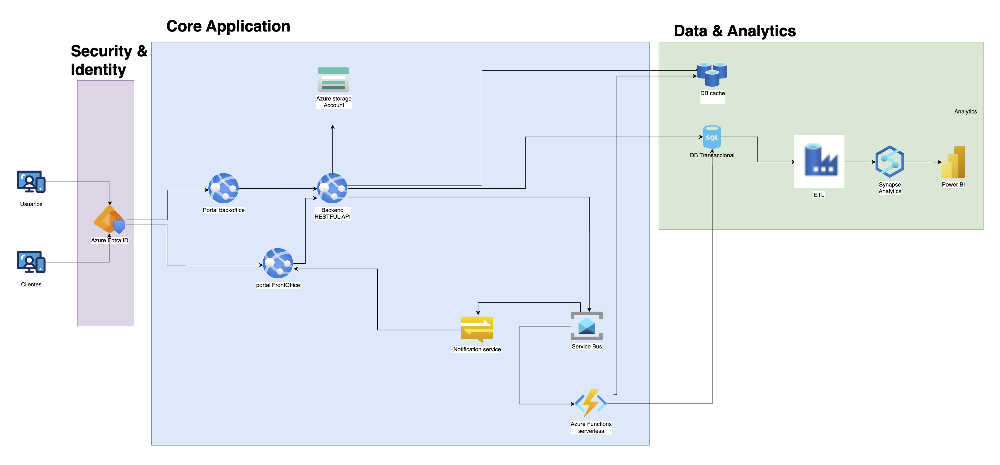
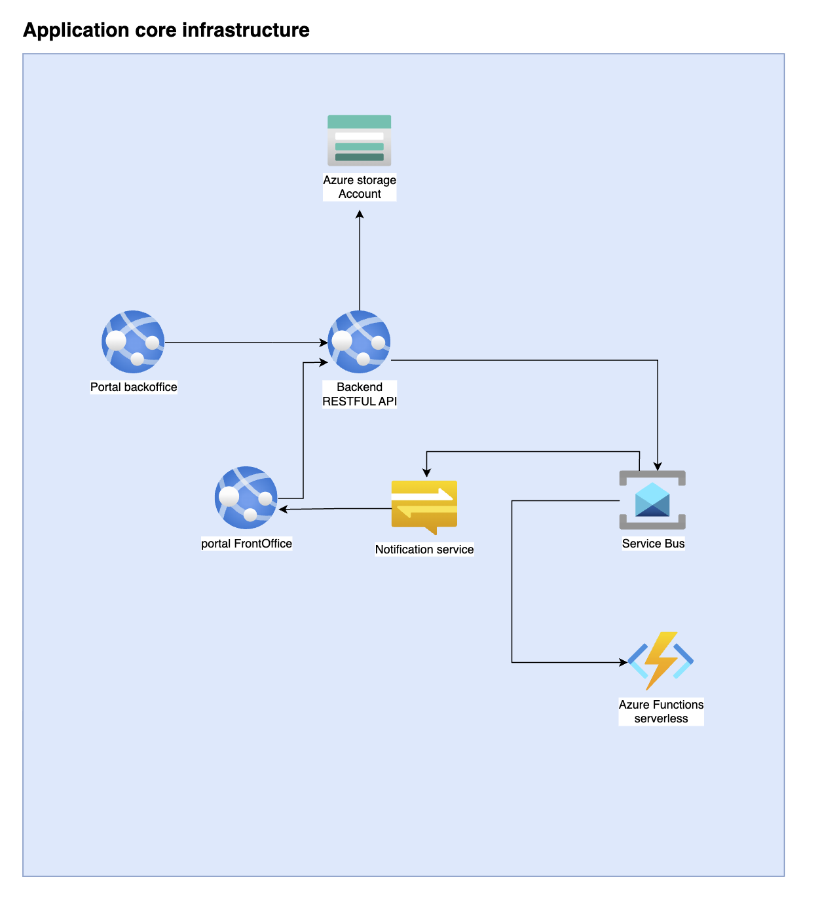
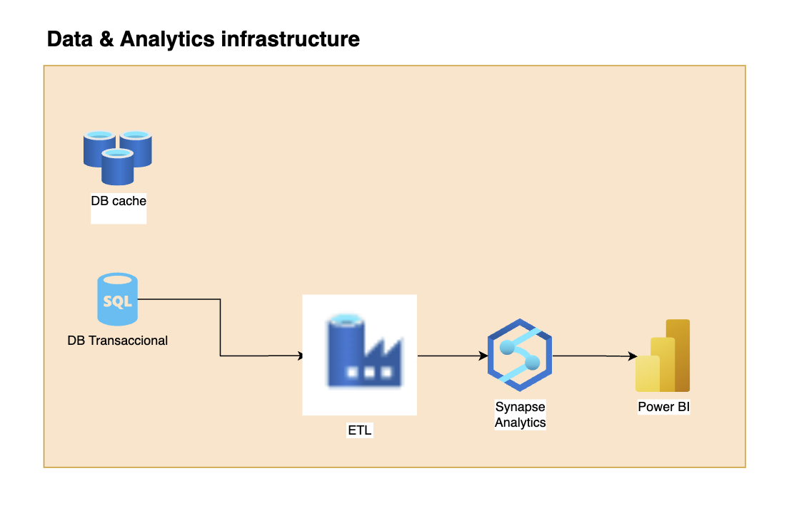
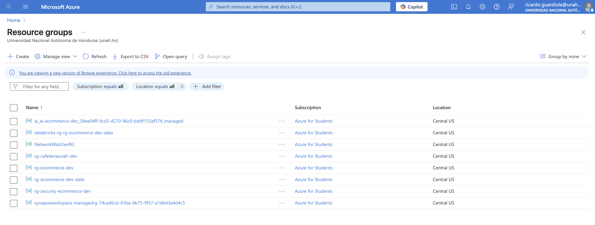
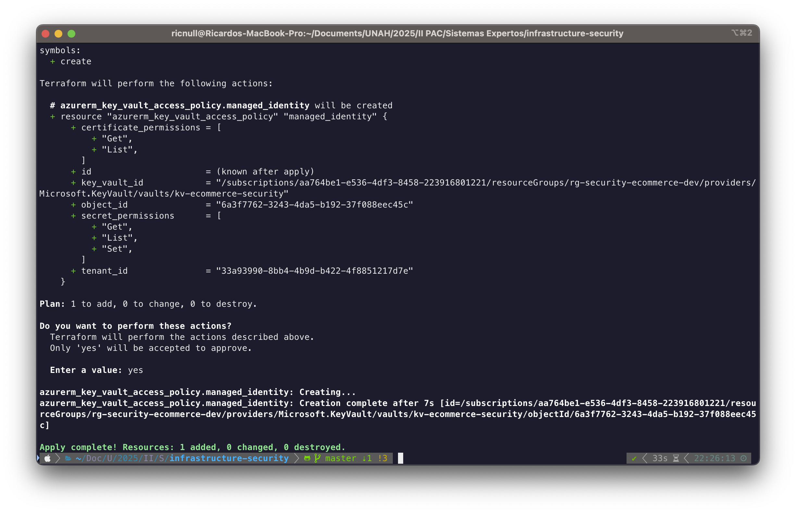
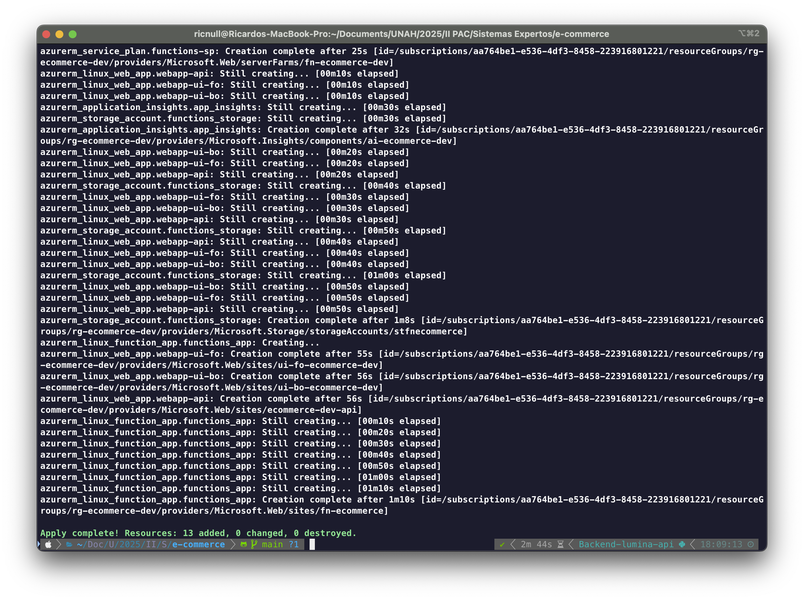
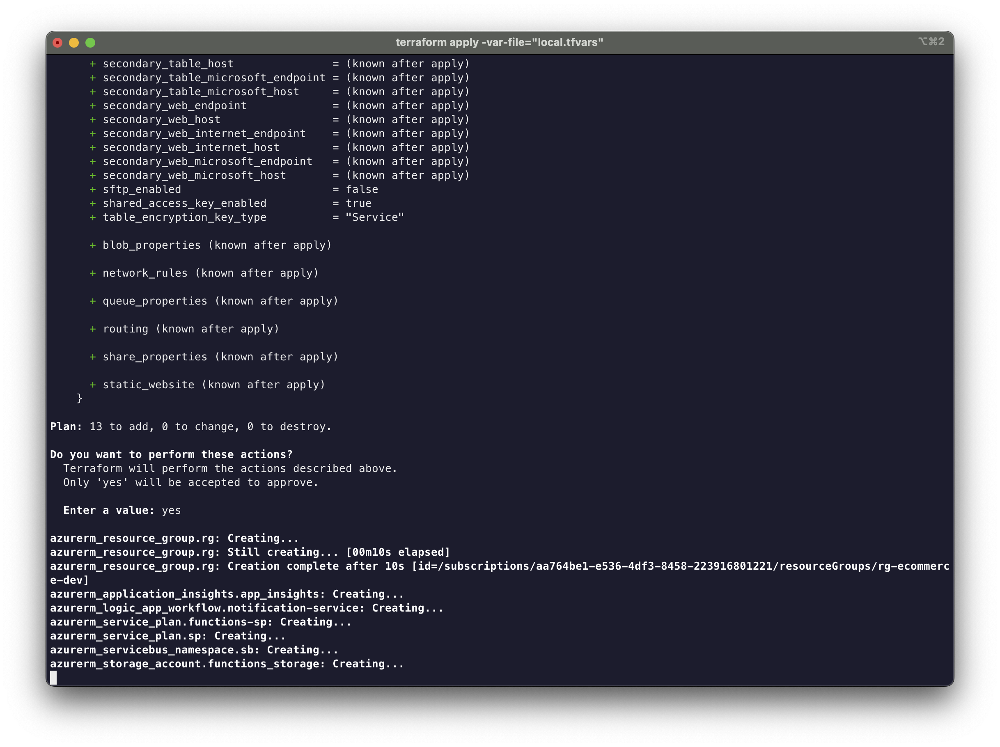
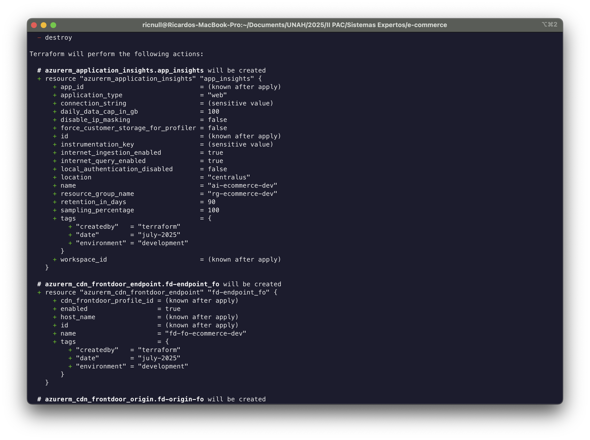

<br />

# Propuesta de Solución: Arquitectura Cloud para Plataforma E-commerce

<br />

Esta propuesta presenta una arquitectura cloud escalable y segura para una plataforma de e-commerce empresarial, implementada sobre Azure. La solución está diseñada siguiendo principios de microservicios, con separación clara de responsabilidades y alta disponibilidad.

### Objetivos Principales:

-- **Escalabilidad**: Arquitectura que soporta crecimiento orgánico del negocio

-- **Seguridad**: Implementación de mejores prácticas de seguridad cloud-native

-- **Disponibilidad**: Garantizar 99.9% de uptime para operaciones críticas

<br />

# Arquitectura de Solución

La arquitectura propuesta se estructura en tres capas principales que proporcionan separación clara de responsabilidades:

<br />

```
┌─────────────────┐    ┌─────────────────┐    ┌─────────────────┐
│   Security &    │───▶│  Core           │───▶│  Data &         │
│   Identity      │    │  Application    │    │  Analytics      │
└─────────────────┘    └─────────────────┘    └─────────────────┘
```



<br />

## **Repositorio 1:** Security & Identity (`ecommerce-security-infra`)

Responsabilidad: Gestión de identidad, autenticación y seguridad perimetral.
Recursos incluidos:

-- Políticas de seguridad y acceso condicional

-- Configuración de autenticación para usuarios y clientes

-- Key Vault para secretos y certificados

-- Network Security Groups y reglas de firewall

-- Configuración de dominios personalizados y SSL

<br />

## **Repositorio 2:** Core Application (`ecommerce-application-infra`)

**Responsabilidad**: Aplicaciones principales, APIs y servicios de negocio.
Recursos incluidos:

-- Portal UI para FrontOffice

-- Portal UI para BackOffice

-- Backend RESTful-API

-- Service Bus y Queue Storage

-- Azure Functions

-- Notification Service

-- Application Insights y configuración de monitoreo aplicativo

<br />

<br />
<br />

## **Repositorio 3:** Data & Analytics (`ecommerce-data-infra`)

Responsabilidad: Almacenamiento, procesamiento y análisis de datos.
Recursos incluidos:

-- Azure Blob Storage (multimedia)

-- Base de datos (DB Cache, DB Transaccional)

-- ETL pipelines y procesamiento de datos

-- Synapse Analytics

-- Power BI (Deshabilitado por temas de costos)

-- Data Factory (si aplica)

-- Backup y recovery policies

<br />

<br />
<br />

# Justificacion:

Análisis de Principios de Arquitectura Aplicados

1. Principio de Responsabilidad Única (Single Responsibility Principle)

-- Cada repositorio tiene una responsabilidad específica y bien definida.

<br />

Security & Identity: Se enfoca exclusivamente en la capa de seguridad porque:

-- Los cambios de seguridad requieren revisiones más rigurosas

-- Las políticas de compliance y auditoría son específicas para seguridad

-- Los ciclos de actualización son más lentos y controlados

<br />

Core Application: Concentra la lógica de negocio porque:

-- Los servicios están altamente acoplados funcionalmente

-- Requieren despliegues coordinados y frecuentes

-- Los desarrolladores necesitan visibilidad completa del stack aplicativo

-- Las pruebas de integración abarcan todos estos componentes

<br />

Data & Analytics: Agrupa todo el ecosistema de datos porque:

-- Los datos tienen ciclos de vida y políticas de retención específicas

-- Los patrones de acceso y performance son similares

<br />

# Acoplamiento Débil y Cohesión Alta

Minimizar dependencias entre repositorios mientras maximizamos la cohesión interna.

<br />
**Security & Identity (Alta cohesión):**

-- Un cambio en autenticación típicamente requiere ajustes en políticas y certificados

-- La configuración de dominios SSL está íntimamente relacionada con la gestión de certificados

<br />

## Core Application (Acoplamiento funcional justificado):

-- El Portal backoffice y Backend API son interdependientes por diseño

-- Service Bus conecta múltiples servicios y debe configurarse atomicamente

-- Azure Functions y Notification Service comparten patrones de configuración

<br />

## Data & Analytics (Cohesión de dominio):

-- Blob Storage, bases de datos y ETL forman un pipeline de datos coherente

-- Las políticas de backup deben aplicarse consistentemente a todos los almacenes

-- Power BI requiere permisos coordinados con Synapse Analytics (Deshabilitado por temas de costos)

-- La configuración de red para datos debe ser uniforme por seguridad

<br />
<br />

# Evidencia de los despliegues:



<br />

# Evidencia en la terminal:






<br />

# Repositorios:

<br />

-- **[Infrastructure Security](https://github.com/MikeWinchester/infrastructure-security)**

-- **[Infrastructure Analytics](https://github.com/MikeWinchester/infrastructure-analytics)**

-- **[Infrastructure Applications](https://github.com/ricjpg/app-infrastructure)**
