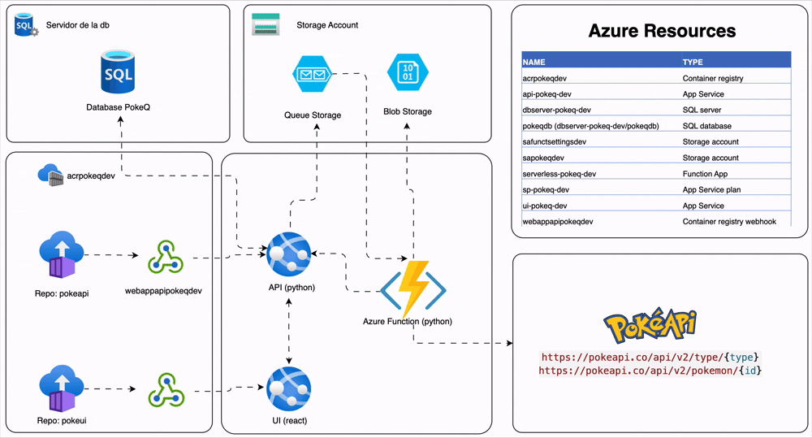

import Frame from "../../components/Frame.astro";



<br />
<br />

# Objetivo General

<Frame>
  Es extender y adaptar esta aplicación base, añadiendo nuevas funcionalidades y
  demostrando tu habilidad para modificar y mejorar un sistema existente que
  debe permanecer desplegado y funcional en Azure.
</Frame>
<br />
<br />

# Contexto Tecnologico

<Frame>

<ol class=' font-mono font-bold'>
  <li >
    -Frontend: Next.js (React)
  </li>
  <li>
  -Backend: API Python con FastAPI desplegada en Azure App Service
  </li>
  <li>
  -Proceso Asíncrono: Azure Functions (Python Queue Trigger)
  </li>
  <li>
  -Base de Datos: Azure SQL Database
  </li>
  <li>
  -Almacenamiento: Azure Blob Storage (para los CSV), 
  </li>
  <li>
  -Azure Queue Storage (para mensajes)
  </li>
  <li>
  -API Externa: PokeAPI
  </li>
  <li>
  -Infraestructura como Código (IaC): Terraform (implícito por la mención del
repositorio)
  </li>
</ol>
</Frame>
<br />

# Tarea 1: Implementar Eliminación Completa de Reportes

<Frame>

El primer paso para implementar la eliminacion fue crear el correspondiente endpoint:

```jsx
{domain}/api/request/{id} <- METHOD_POST (Para el registro)
```

<br />
Ese endpoint toma el id y hace una busqueda en la base de datos verificando si el
registro existe Si el registro existe entonces ejecuta un metodo que ejecuta un query
donde se elimina el registro, este metodo tambien envia un mensaje al queue DeleteQueue
luego azure worker o azure function llamado serverless-pokeq-dev toma ese mensaje
y procede con la eliminacion del blob file, el cual se hizo mediante el metodo .delete_blob()
que esta incluido en el SDK de Azure.

</Frame>
<br />
<br />

# Tarea 2: Enriquecer Reporte con Detalles del Pokémon

<Frame>

Se necesitaba extraer datos de la API de Pokémon desde dos estructuras diferentes:

1. **Lista básica**: Con nombres y URLs de Pokémon
2. **Endpoint detallado**: Con stats y abilities tras hacer peticiones HTTP

Inicialmente se crearon funciones que mantenían la estructura jerárquica original:

```python
data_dict = {
    "name": "Pokemon",
    "stats": {"hp": 39, "attack": 52, ...},
    "abilities": [{"blaze": "blaze"}, ...]
}
```

<br />
<br />
### 1. Procesamiento Masivo - `process_pokemon_list_for_dataframe()`

**Propósito**: Procesar listas completas de Pokémon

**Proceso**:

- Itera sobre lista de Pokémon
- Aplica extracción individual a cada elemento
- Maneja fallos individuales sin romper el proceso completo

<br />
<br />

### 2. Creación de DataFrame - `create_pokemon_dataframe()`

**Propósito**: Convertir datos planos a DataFrame organizado

**Características**:

- Reordena columnas lógicamente (básicas → stats → abilities)
- Ordena columnas de abilities automáticamente
- Maneja columnas dinámicas (diferentes números de abilities)

<br />
<br />
### 3. Exportación Directa - `export_pokemon_to_csv()`

**Propósito**: Flujo completo de extracción a CSV

**Características**:

- Combina todas las funciones anteriores
- Genera estadísticas del proceso
- Manejo de encoding UTF-8

## Decisiones de Diseño Clave

### Aplanamiento de Datos

**Problema**: DataFrames/CSV no manejan bien estructuras anidadas

**Solución**:

- Stats: `stats.hp` → `hp` (columna directa)
- Abilities: Array complejo → múltiples columnas (`ability_1_name`, `ability_1_is_hidden`, etc.)

### Manejo de Abilities Variables

**Problema**: Pokémon tienen diferente número de habilidades

**Solución**:

```python
# Columnas dinámicas por habilidad
ability_1_name,
ability_2_name
# + columnas resumen
all_abilities: "blaze, solar-power"
total_abilities: 2
```

### Organización de Columnas

Se estableció un orden lógico:

1. **Identificación**: name, url
2. **Stats de combate**: hp, attack, defense, etc.
3. **Resumen de abilities**: total_abilities, all_abilities
4. **Detalles de abilities**: ability_1_name, ability_2_name, etc.

### Manejo de Errores Robusto

- Peticiones HTTP con try-catch
- Continúa procesando aunque falte un Pokémon
- Mensajes informativos de progreso

</Frame>
<br />
<br />

# Tarea 3: Reportes con Muestreo Aleatorio

Permite al usuario especificar un número máximo de registros aleatorios a incluir
en el reporte.

<Frame>
Frontend
<br />
Utilizando la libreria radix-ui se utilizo el componente ```label-input``` para obtener 
el tamaño del sample desde el lado del clientes
</Frame>
<br />
<br />
<Frame>
Backend
<br />
Se modifico el endpoint 
```jsx
http://{domain}/api/requests/{type}/{sample_size}
```
para obtener mediante un path variable el numero de registros requeridos por el usuario
<br />
Se modifico el modelo en pydantic de manera que este tuviera un nuevo campo llamado
```sample_size``` que es un numero entero mayor o igual a cero (0)
<br />
Se hizo la modificacion correspondiente en la base de datos y tambien en el procedimiento almacenado
para seguir utilizando esa misma funcionalidad solamente con pequeños ajustes

</Frame>
<br />
<br />
<Frame>
Worker
<br />
Mediante la funcion ```get_request(id)``` obtenemos un json con los datos de la solicitud, incluyendo el 
sample size, aprovechamos esto para para validar si el tamaño deseado de la muestra es menor a numero de 
registros que contiene el tipo de pokemon requerido por el usuario, si llega a ser menor entonces
utilizamos la funcion 'Recortamos' el arreglo con la lista de pokemones antes de que se agreguen todos los
detalles que utilizaremos en el dataframe de la siguiente manera: 
```python
sample_pokemon_list = pokemon_list[:random.randint(1, list_len)]
```
si la muestra requerida por el usuario llega a ser mayor que la lista obtenia desde la API de Pokemon
entonces devolveremos todos los pokemones del mismo tipo que esten disponibles en la API

</Frame>
<br />
<br />

<Frame>
## 🔗 Enlaces importantes:

<br />
<ol class='text-green-500 font-mono font-bold'>
  <li >
    {" "}
    [🔗 Portal UI - Desplegado](https://ui-pokeq-dev.azurewebsites.net/)
  </li>
  <li>
    {" "}
    [🔗 Repositorio en GitHub de la API](https://github.com/ricjpg/pokeq.api)
  </li>
  <li>
    {" "}
    [🔗 Repositorio en GitHub de la UI](https://github.com/ricjpg/pokeq.ui)
  </li>
  <li>
    {" "}
    [🔗 Repositorio en GitHub del Azure Function](https://github.com/ricjpg/pokeq.funct)
  </li>
  <li>
    {" "}
    [🔗 Repositorio en GitHub de la Base de datos](https://github.com/ricjpg/pokeq.sql)
  </li>
  <li>
    {" "}
    [🔗 Repositorio en GitHub de la Arquitectura](https://github.com/ricjpg/pokeq.tf)
  </li>
</ol>
</Frame>
```
````
