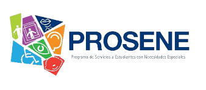

 
 

## 🧩 Context: Identifying the Problem

The **Programa de Servicios a Estudiantes con Necesidades Especiales (PROSENE)**, a support unit within the Universidad Nacional Autónoma de Honduras (UNAH), faced significant challenges in communication and service management. Students requiring assistance had to physically visit PROSENE’s offices to submit requests—a serious barrier, particularly for individuals with disabilities. This analog process created delays, accessibility issues, and inefficiencies in request tracking and response.

 

## 💡 Solution: A Digital and Inclusive Platform

To address this problem, we developed a **web application** that enables students to easily submit service requests online. The platform allows PROSENE staff to:

- Receive and manage student requests in real time.
- Track the status and history of all requests.
- Provide timely feedback and updates to students.
- Improve accessibility, transparency, and efficiency.

By digitalizing the process, the platform ensures students receive quicker support and reduces the need for in-person visits, aligning with accessibility best practices.

 

## 🛠️ Technologies Used

- **Frontend:** Vue.js, HTML, CSS
- **Backend:** Python, FastAPI, JWT Authentication
- **Database:** PostgreSQL (deployed via AWS RDS)
- **Deployment:** Vercel (Frontend) + AWS RDS (Database)

 

## 🚀 Impact and Highlights

- Enhanced accessibility for students with special needs.
- Streamlined communication between students and PROSENE staff.
- Full-stack development with real deployment, authentication, and role-based access control.
- Built using Agile practices and version control with Git.

 

## 🔗 Notes

This project was developed as part of a university initiative to solve real problems on campus through technology. It stands as a practical example of accessible digital transformation and inclusive UX design.
