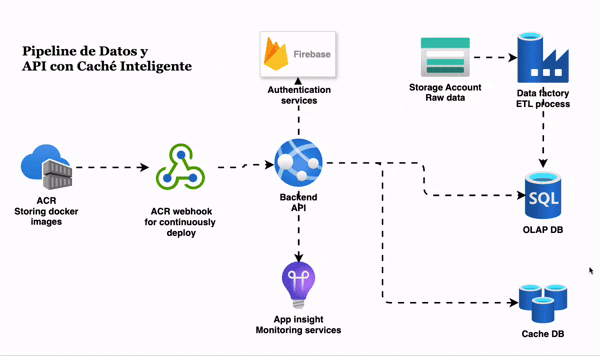

import Frame from "../../components/Frame.astro";



<br />
<br />

# Objetivo General

<Frame>
  Desarrollar una solución integral de backend que demuestre la capacidad de
  migrar datos a gran escala, exponerlos a través de una API segura y
  optimizada, y desplegarla en un entorno de nube productivo. El proyecto
  culmina con la implementación de un sistema de monitoreo y una estrategia de
  caché con invalidación automática.
</Frame>
<br />
<br />

# Fase 1: Preparación y Migración de Datos

<Frame>

El primer paso es construir la base de datos en la nube que alimentará nuestra aplicación.

<br />
**Selección del Dataset:** Para el desarrollo de este proyecto seleccione el dataset
**Spotify Tracks DB** - el cual puedes encontrar en el siguiente link:

<br />- [🔗 Spotify Tracks
DB](https://www.kaggle.com/datasets/zaheenhamidani/ultimate-spotify-tracks-db)
este cuenta com mas de 200mil registros, lo que no servira para las pruebas de
tiempo.
<br />

**Migración de Datos con Azure Data Factory:** <br/>
Utilizando  **Azure Data Factory** creamos un pipeline que extraiga los datos del dataset seleccionado (previamente
subido a un Azure Blob Storage como un archivo .csv). Transformamos y cargamos estos
datos en una tabla específica dentro de una base de datos provisionada en  **Azure Database SQL**

</Frame>
<br />
<br />

# Fase 2: Desarrollo de API y Autenticación 🔐

<Frame>

Con los datos en la nube, procedemos a la construccion de nuestro backend, aplicando
buenas prácticas de desarrollo y seguridad.

<br />
## **Tecnología:** - FastAPI Python - Firebase

</Frame>
<br />
<br />

# Fase 3: Monitoreo de Rendimiento

<Frame>

Utilizamos el servicio de Azure Applications Insights para observar el comportamiento de la API, con esto podemos capturar
telemetría, trazas de solicitudes, tiempos de respuesta y posibles errores en los request a los diferentes endpoints.

</Frame>
<br />
<br />

# Fase 4: Implementación de Caché con Redis (El Reto)

<Frame>

Implementamos una base de datos de cache (**Azure cache database**) para mejorar los tiempos de respuesta al endpoint `/features`
Este endpoint es responsable de devolver los primeros 100,000 registros de la base de datos spotify.features, que es aproximadamente
15mb, esto se hizo meramente con propositos didacticos, ya en en un entorno real/profesional, esto deberia de estar paginado para
no sobrecargar la respuesta.
Una vez llamado por primera vez este endpoint, se realiza un proceso de escritura en la base de datos de cache con la clave `spotify:features:all`
indicanto que de la tabla features, este responde con toda la data y no esta filtrada, de esta manera en la siguiente llamada al endpoint
se realiza la verificacion de la clave `spotify:features:all` en la base de datos de cache para poder entregar la respuesta desde esta base de datos

<br />

Con este mismo metodo podemos cachear las respuestas en el endpoint

```js
/features/custom?=arg
```

el cual recibe un argumento que es encargado de
filtrar la respuesta de esta consulta, por ejemplo: al pasar el argumento `arg=Pop` nos retornada todos los registros de los cuales el generado
sea Pop, al mismo tiempo se creara una key para la base da datos de cache con este argumento, para este caso: `spotify:features:Pop`

</Frame>
<br />

<br />

# Fase 5: Invalidación de Caché

<Frame>

Estas key en la base de datos de cache seran eliminadas despues de 3600 segundos, el equivalente a una hora, este parametro podria ser modificado
para orientarlo con los objetivos del negocio. Tambien estas llaves son eliminadas cuando se carga un nuevo registro del mismo genero desde el
endpoint

```js
/features/new
```

Supongamos que cargamos el siguiente payload:

```json {1}
{
  "genre": "Dance",
  "artist_name": "Lana Del Rey",
  "track_name": "Pretty When You Cry",
  "track_id": "6PnluwP0fjGnpIBsqTdUTq",
  "popularity": "60",
  "duration_ms": "234147"
}
```

Esto eliminara la llave si acaso existe en la base de datos de cache

```json
spotify:features:Dance
```

para que cuando se haga el llamo al endpoint /features/custom?=Dance no se devuelva una respuesta que no contenga todos los datos
esto conlleva a que cuando se haga el primer llamado a este endpoint la respuesta sea lenta, debido a que no esta cacheada y Tambien
debe de hacer un proceso de escritura en la base de datos de cache, pero la segunda y posteriores llamadas seran significativamente
mas rapidas.

</Frame>
<br />

# Fase 6: Despliegue en la Nube con Docker 🐳

<Frame>
Finalmente vamos a empaquetar la aplicacion en una imagen de docker para poder desplegarla en un Azure container Registry

Creamos un Dockerfile en la raiz del directorio donde esta ubicada nuestra aplicacion y configuramos el entorno,
hacemos un update, copiamos nuestra app y seteamos nuestras variables de entorno, luego de eso exponemos un puerto de la siguiente manera:

```jsx

FROM python:3.10-slim

WORKDIR /app

RUN apt-get update && \
    apt-get install -y curl apt-transport-https gnupg gcc g++ make && \
    curl https://packages.microsoft.com/keys/microsoft.asc | apt-key add - && \
    curl https://packages.microsoft.com/config/debian/10/prod.list > /etc/apt/sources.list.d/mssql-release.list && \
    apt-get update && \
    ACCEPT_EULA=Y apt-get install -y msodbcsql17 && \
    apt-get clean && \
    rm -rf /var/lib/apt/lists/*

COPY requirements.txt .

RUN pip install --no-cache-dir -r requirements.txt

COPY . .

RUN test -f .env && rm .env || echo "no .env file found"

EXPOSE 8000

CMD [ "uvicorn" , "main:app", "--host" , "0.0.0.0" , "--port" , "8000" ]

```

utilizamos los siguientes comandos para poder subir nuestra imagen de docker al container registry:

```bash
docker push acrapicache.azurecr.io/api-cache:latest
```

</Frame>
<br />
<br />

<Frame>
<ol >
Rutas importantes:
<li class='text-green-500'>
Security
```jsx
{domain}/signup <- METHOD_POST (Para el registro) 
{domain}/login <- METHOD_POST (devuelve un token)

````
</li>
<li class='text-green-500'>
Resources
```jsx
{domain}/features <- METHOD_GET (devuelve los primero 100k registros)
{domain}/features/custom?=arg <- METHOD_GET (Devuleve una lista filtrada por el argumento arg)
{domain}/features/new <- METHOD_POST (Crea un nuevo registro en la db) Requiere Autenticacion y Autorizacion

````

</li>
<li class='text-green-500'>
MISC
```jsx
{domain}/ <- METHOD_GET (Devulve un saludo) Requiere Autenticacion
{domain}/api/version <- METHOD_GET (devuelve la version de la API)

````

</li>
</ol>
</Frame>

<Frame>
## 🔗 Enlaces importantes:

<br />
<ol class='text-green-500 font-mono font-bold'>
  <li >
    {" "}
    [🔗 Enlace de la API](https://api-cache-hfeva3d2bfcbehhu.eastus-01.azurewebsites.net/)
  </li>
  <li>
    {" "}
    [🔗 Enlace del Repositorio en GitHub](https://github.com/ricjpg/pipeline-cache)
  </li>
</ol>
</Frame>
```
````
